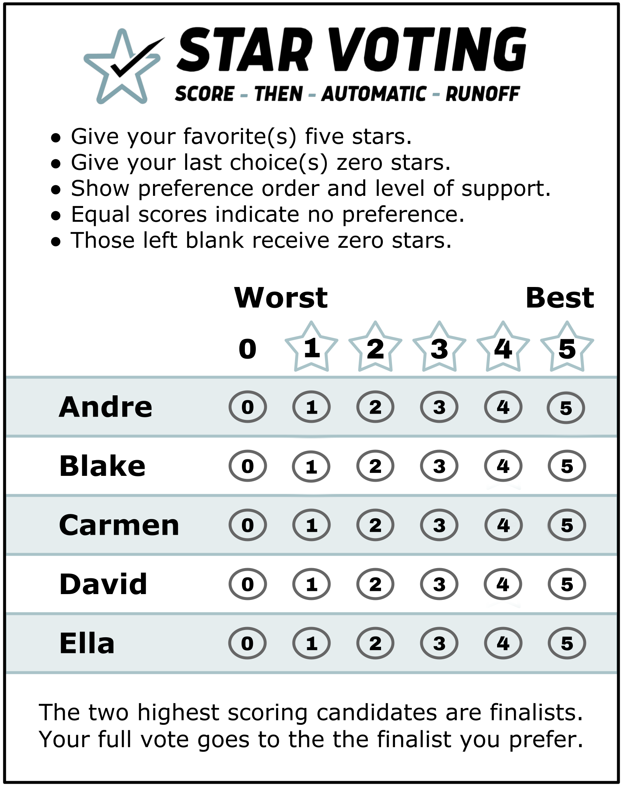

# STAR Voting

[STAR voting](https://www.starvoting.org/) is a relatively-new ["electoral system"](https://en.wikipedia.org/wiki/Electoral_system)--a
method of running an election.  

STAR Voting is simple--it's simple to vote, and simple to tabulate.  

And while a completely fair and perfect electoral system is impossible, STAR Voting's approach makes sensible tradeoffs
and avoids the worst pitfalls.  It's really great!

## A quick STAR Voting primer

When you vote using STAR Voting, your ballot looks something like this:

To vote, give every candidate a score from 0 to 5.  5 means you like
them the most, 0 means you like them the least.  (If you don't pick one
of the scores, that's the same as a 0.)  If you give two candidates
the same score, that means you like them equally--you don't have a
preference between them.

Tabulating the election is easy!  You apply the **STAR** method:
**S**core, **T**hen **A**utomatic **R**unoff.

In the first round, the *Scoring Round,* you add up the scores of all the
candidates.  The top two scoring candidates automatically advance to
the second round.

In the second round, the *Automatic Runoff Round,* you examine every
ballot to see which of the two remaining candidates they preferred.
If one has a higher score, that ballot prefers that candidate.  If the
ballot scored both candidates the same, they have no preference.
The candidate preferred by more ballots wins the election.  It's that
simple!

And notice--you always examine every ballot.  STAR Voting never throws
away ballots.  When you vote, your vote always matters,
every step of the way.

## What's so good about STAR Voting?

Electoral systems are a surprisingly deep topic.  They've been studied
for hundreds of years, and there are many *many* different approaches.
There are a number of desirable properties *and* undesirable properties
that electoral systems can have.  And here's the bad news: it's
*impossible* for there to be one best-possible voting system.  There
are mutually exclusive desirable properties, and there are desirable
properties that bring with them downsides.  You just can't make a
one-size-fits-all best system that avoids every problem--every electoral
system has to be a compromise.  Wikipedia has
[a comprehensive article](https://en.wikipedia.org/wiki/Comparison_of_electoral_systems)
on the topic.

STAR Voting avoid the worst problems of electoral systems.
The remaining undesirable properties were chosen as the least-bad
option.

Here are some desirable properites STAR Voting has:

* It's [monotonic.](https://en.wikipedia.org/wiki/Monotonicity_criterion)
  Giving a candidate a higher score can never hurt them, and
  giving a candidate a lower score can never help them.  (And yes,
  this is not always true of voting systems.  The increasingly popular
  [Instant Runoff Voting](https://en.wikipedia.org/wiki/Instant-runoff_voting)
  fails this; paradoxically, it's possible to *hurt* a candidate you
  prefer by giving them a *higher* score.)
* It's [resolvable.](https://en.wikipedia.org/wiki/Resolvability_criterion)
  Ties are unlikely.
* It complies with the [majority loser criterion.](https://en.wikipedia.org/wiki/Majority_loser_criterion)
  If a majority of candidates like one candidate the least, that candidate will
  never win a STAR Voting election.

But here are some desirable properties STAR Voting doesn't have:

* It's not a [Condorcet method,](https://en.wikipedia.org/wiki/Condorcet_winner_criterion)
  which is a very particular property of an electoral system.
  Let's say you have an election with three candidates, A, B, and C.  You ask each voter
  to vote in three head-to-head races: "which do you like better, A or B?", "which do
  you like better, B or C?", and "which do you like better, A or C?"  If there's one
  candidate that wins in every such head-to-head vote in the election, they would be
  the "Condorcet winner", and an electoral system that guarantees the "Condorcet winner"
  will win the election is called a "Condorcet method".  STAR isn't a Condorcet method,
  because Condorcet doesn't take into consideration the strength of preference.  So
  STAR can arguably give a better result.  (On the other hand, STAR does guarantee
  the opposite: a [Condorcet loser](https://en.wikipedia.org/wiki/Condorcet_loser_criterion)
  will never win a STAR election.  And, as a practical matter, it's frequently true
  that the winner of a STAR election just happens to be the Concorcet winner.)
* It doesn't satisfy the [majority criterion.](https://en.wikipedia.org/wiki/Majority_criterion)
  The majority criterion requires: *"if one candidate is ranked first by a majority of voters,
  that candidate must win".*
* It doesn't satisfy the [later-no-harm criterion.](https://en.wikipedia.org/wiki/Later-no-harm_criterion)
  Later-no-harm requires that if you've already expressed a preference for a candidate on your
  ballot, you shouldn't be able to harm that candidate by expressing another preference for
  another candidate later on the ballot.  STAR fails this; giving a higher vote to a
  less-preferred candidate might mean that your more-preferred candidate doesn't get
  elected.  The STAR Voting team [wrote an essay on why they gave up on this criterion.](https://www.starvoting.org/pass_fail)
  The short version is: electoral systems that satisfy later-no-harm generally also
  exhibit
  [the spoiler effect,](https://en.wikipedia.org/wiki/Vote_splitting#%22Spoiler_effect%22)
  which is a worse property.  But achieving later-no-harm *and* avoiding the spoiler effect
  makes your electoral system even worse!

(If there isn't a best-possible voting system, is there a worst-possible?  Maybe!
If there *is* a worst electoral system, it's almost certainly
[Plurality voting](https://en.wikipedia.org/wiki/Plurality_voting)...
the predominant electoral system used here in the United States.  Sigh.)
